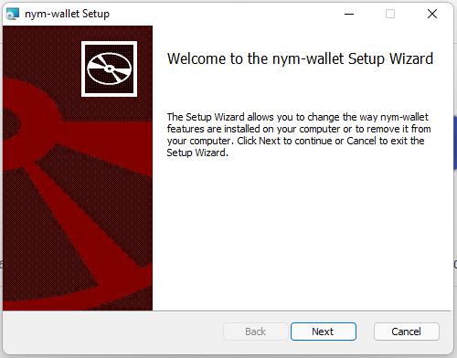
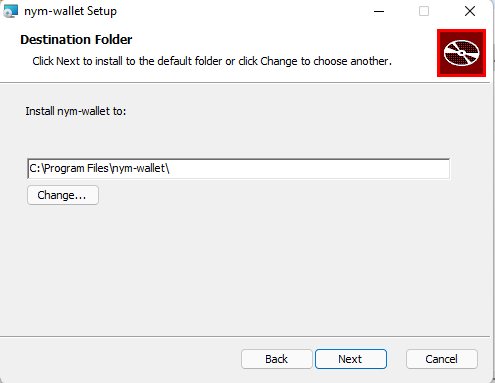
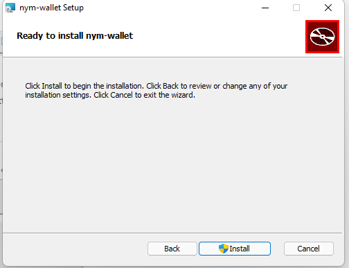
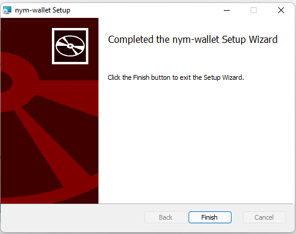

# Desktop Wallet


The Nym Desktop Wallet lets you interact with your Nym node and to delegate stake to others, see the vesting schedule of tokens, and transfer tokens. In future releases, it will also let you access the Nym mixnet.

You can download it for Mac, Windows, or Linux.

[](https://github.com/nymtech/nym/releases/tag/nym-wallet-v1.2.4)

### Bypassing security warnings

On Windows you will see a security warning pop up when you attempt to run the wallet. We are in the process of getting app store keys from Microsoft so that this doesn't happen. See the section below for details on steps to bypass these.

#### Linux

You will need to `chmod +x` the AppImage in the terminal (or give it execute permission in your file browser) before it will run.

#### Windows

_You will still encounter warnings when opening the wallet on Windows. This is because - although the wallet is approved by Microsoft - it has less than 10 thousand downloads at the current time. Once the wallet has passed this threshold, this warning will disappear._

Follow the steps below to bypass the warnings.

* Select more-info after clicking the msi installer app:


* Proceed to 'run-anyway':



* Follow the installer instructions:







### For developers

If you would like to the compile the wallet yourself, follow the instructions below.

> Please note that the wallet has currently only been built on the operating systems for which there are binaries as listed above. If you find an issue or any additional prerequisties, please create an issue or PR against `develop` on [Github](https://github.com/nymtech/docs).

#### Software prerequisites for building the wallet

- `git`

```
sudo apt update
sudo apt install git
```

Verify `git` is installed with:

```
git version
# Should return: git version X.Y.Z
```

- [Yarn](https://yarnpkg.com/)

- `NodeJS >= v16.8.0`

- `Rust & cargo >= v1.56`

We recommend using the [Rust shell script installer](https://www.rust-lang.org/tools/install). Installing cargo from your package manager (e.g. `apt`) is not recommended as the packaged versions are usually too old.

If you really don't want to use the shell script installer, the [Rust installation docs](https://forge.rust-lang.org/infra/other-installation-methods.html) contain instructions for many platforms.

#### Additional prerequisites for Ubuntu/Debian systems

```
sudo apt update
sudo apt install pkg-config build-essential libssl-dev curl jq
```

#### Additional prerequisites for Windows

- When running on Windows you will need to install the `c++` build tools.
- An easy guide to get Rust up and running can be found [here](http://kennykerr.ca/2019/11/18/rust-getting-started/).
- When installing `NodeJS` please use the `current features` version.
- Using a package manager like [Chocolatey](https://chocolatey.org/) is recommended.

### Removing signing errors when building in development mode

If you're wanting to build the wallet yourself, you will need to make a few modifications to the file located at `nym-wallet/src-tauri/tauri.conf.json` before doing so. These relate to the wallet being accepted by Mac and Windows app stores, and so aren't relevant to you when building and running the wallet yourself.

On **all** operating systems:
* set the value of line 49 to `false`
* remove lines 50 to 54

As well as these modifications for MacOS and Windows users:
* MacOS users must also remove line 39
* Windows users must remove lines 42 to 46

### Installation
Once you have made these modifications to `tauri.conf.json`, inside of the `nym-wallet` folder, run:

```
yarn install
```

### Running in Development Mode

> Make sure you copy over the contents of the provided `.env.sample` to a new `.env` file before proceeding

You can run the wallet without having to install it in development mode by running the following terminal command from the `nym-wallet` folder

```
yarn dev
```

This will then start the Wallet GUI and produce a binary in `nym-wallet/target/debug/` named `nym-wallet`.

### Running in Production Mode

> Make sure you copy over the contents of the provided `.env.sample` to a new `.env` file before proceeding

To build and install the wallet, run the following terminal command from the `nym-wallet` folder.

```
yarn build
```

This will build an executable file that you can use to install the wallet on your machine. The output will compile different types of binaries dependent on your hardware / OS system. Once the binaries are built, they can be located as follows:

```
Binary output directory structure
**macos**
|
└─── target/release
|   |─ nym-wallet
└───target/release/bundle/dmg
│   │─ bundle_dmg.sh
│   │─ nym-wallet.*.dmg
└───target/release/bundle/macos/MacOs
│   │─ nym-wallet
|
**Linux**
└─── target/release
|   │─  nym-wallet
└───target/release/bundle/appimage
│   │─  nym-wallet_*_.AppImage
│   │─  build_appimage.sh
└───target/release/bundle/deb
│   │─  nym-wallet_*_.deb
|
**Windows**
└─── target/release
|   │─  nym-wallet.exe
└───target/release/bundle/msi
│   │─  nym-wallet_*_.msi
```

### Importing or creating account(s) when you have signed in with mnemonic
To import or create a new account, first you need to create a password for your wallet:

1. Log out from the wallet
2. Sign in using "Sign in with mnemonic" button
3. On the next screen select “Create a password"
4. Type in the mnemonic you want to create a password for and follow the next steps
5. Sign back in the wallet using your new password
6. Come back to this page to import or create new accounts

### Importing or creating account(s) when you have signed in with mnemonic but a password already exists on your machine
To import or create a new account, you need to log in with your existing password or create a new password.

> Creating a new password will overwrite any old one stored on your machine. Make sure you have saved any mnemonics associated with the password before creating a new one.

1. Log out
2. Click on “Forgot password”
3. On the next screen select “Create new password”
4. Follow the instructions and create a new password
5. Sign in using your new password

### CLI tool for wallet encrypted file (password) recovery:
The mnemonics that are stored in the local password protected file can also be decrypted and recovered through a simple CLI tool, `nym-wallet-recovery-cli`.

```
nym-wallet-recovery –file saved-wallet.json –password foo
```

The saved wallet file can be found in `$XDG_DATA_HOME` or `$HOME/.local/share` on Linux, `$HOME/Library/Application Support` on Mac, and `C:\Users\username\AppData\Local` on Windows.
