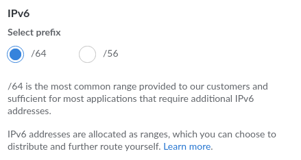

# Troubleshooting VPS Setup

```admonish info
To monitor the connectivity of your Exit Gateway, use results of probe testing displayed in [harbourmaster.nymtech.net](https://harbourmaster.nymtech.net).
```

## IPv6 troubleshooting

### Incorrect Gateway Network Check

Nym operators community is working on a Nym version of tors [good bad ISP table](https://community.torproject.org/relay/community-resources/good-bad-isps/). There is no one solution fits all when it comes to connectivity setup. The operation of `nym-node` will vary depending on your ISP and chosen system/distribution.  While few machines will work out of the box, most will work after uisng our connectivity configuration guide, some need more adjustments.

Begin with the steps listed in [*Connectivity Test and Configuration*](../nodes/vps-setup.md#connectivity-test-and-configuration) chapter of VPS Setup page. If you still have a problem with the IPv6 connectivity try:

1. Tor community created a helpful [table of ISPs](https://community.torproject.org/relay/community-resources/good-bad-isps/). Make sure your one is listed there as a *"good ISP"*. If not, consider migrating!
2. Checkout your VPS dashboard and make sure your IPv6-public enabled.
3. If you are able to add IPv6 address `/64` range, do it.

**Update:** Nym community started an ISP table called [*Where to host your nym node?*](../legal/isp-list.md), check it out and add your findings!



4. Search or ask your ISP for additional documentation related to IPv6 routing and ask them to provide you with `IPv6 IP address` and `IPv6 IP gateway address`
- For example Digital Ocean setup isn't the most straight forward, but it's [well documented](https://docs.digitalocean.com/products/networking/ipv6/how-to/enable/#on-existing-droplets) and it works.

5. Search for guides regarding your particular system and distribution. For Debian based distributions using systemd, some generic guides such as [this one](https://cloudzy.com/blog/configure-ipv6-on-ubuntu/) or [this one](https://help.ovhcloud.com/csm/en-ie-vps-configuring-ipv6?id=kb_article_view&sysparm_article=KB0047567) work as well.

### Network configuration

On modern Debian based Linux distributions, network is being configure by either [Netplan](www.netplan.io) or [ifup/ifdown](https://manpages.debian.org/testing/ifupdown/ifup.8.en.html) utilities . It is very easy to check which one you have.

1. If you have the following folder `/etc/netplan` which has got a YAML file - you are likely to have Netplan.
2. If you have the following folder `/etc/network` and it is not empty - you are likely to have ifup/down.

Most contemporary Ubuntu/Debian distributions come with Netplan, however it is possible that your hosting provider is using a custom version of ISO. For example, Debian 12 (latest version as of June 2024) may come with ifup/down.

Nym operator community members have tested a VPS with Netplan and where in some cases `nym-node --mode exit-gateway` was not routing IP packets properly even after running `network_tunnel_manager.sh` script. We are working on a guide to setup Netplan configuration manually for such cases.

Configuration of ifup/ifdown is a bit simpler. If the `network_tunnel_manager.sh` script doesn't do the job, open `/etc/network/interfaces` file (research if your system uses a different naming for it) and configure it similarly to this:

```sh
auto lo
iface lo inet loopback

auto eth0
iface eth0 inet static
address <YOUR_IPV4_ADDRESS>
netmask NETMASK

gateway <YOUR_IPV4_GATEWAY>
iface eth0 inet6 static
        accept_ra 0
        address <YOUR_IPV6_ADDRESS>
        netmask 64
        gateway <YOUR_IPV6_GATEWAY>
post-up /sbin/ip -r route add <YOUR_IPV6_GATEWAY> dev eth0
post-up /sbin/ip -r route add default via <YOUR_IPV6_GATEWAY>
```
Last two lines are particularly important as they enable IPv6 routing. You can find YOUR_IPV6_GATEWAY using your server's control panel. There is no single way to find the gateway, so please access your control panel to find yours or open a support ticket. Here is an example of how it looks on [OVH](https://help.ovhcloud.com/csm/en-ie-vps-configuring-ipv6?id=kb_article_view&sysparm_article=KB0047567).

```admonish warning title="WARNING"
Be extra careful editing this file since you may lock yourself out of the server. If it happens, you can always access the server via the hoster's VNC panel.
```

Once finished, save the file and reboot the server. Now, running `ip a` command should return correct IPv4 and IPv6 addresses.

Finally re-run `network_tunnel_manager.sh` script, following the steps in node [IPv6 configuration chapter](https://github.com/nymtech/nym/nodes/configuration.md#ipv6-configuration).

## Other VPS troubleshooting

### Virtual IPs and hosting via Google & AWS

For true internet decentralization we encourage operators to use diverse VPS providers instead of the largest companies offering such services. If for some reasons you have already running AWS or Google and want to setup a `<NODE>` there, please read the following.

On some services (AWS, Google, etc) the machine's available bind address is not the same as the public IP address. In this case, bind `--host` to the local machine address returned by `$(curl -4 https://ifconfig.me)`, but that may not the public IP address to bond your `<NODE>` in the wallet.

You can run `ifconfig` command. For example, on a Google machine, you may see the following output:

```sh
ens4: flags=4163<UP,BROADCAST,RUNNING,MULTICAST>  mtu 1460
        inet 10.126.5.7  netmask 255.255.255.255  broadcast 0.0.0.0
        ...
```

The `ens4` interface has the IP `10.126.5.7`. But this isn't the public IP of the machine, it's the IP of the machine on Google's internal network. Google uses virtual routing, so the public IP of this machine is something else, maybe `36.68.243.18`.

To find the right IP configuration, contact your VPS provider for support to find the right public IP and use it to bond your `<NODE>` with the `nym-api` via Nym wallet.

On self-hosted machine it's a bit more tricky. In that case as an operator you must be sure that your ISP allows for public IPv4 and IPv6 and then it may be a bit of playing around to find the right configuration. One way may be to bind your binary with the `--host` flag to local address `127.0.0.1` and run `echo "$(curl -4 https://ifconfig.me)"` to get a public address which you use to bond your Mix Node to `nym-api` via Nym wallet.

It's up to you as a node operator to ensure that your public and private IPs match up properly.
